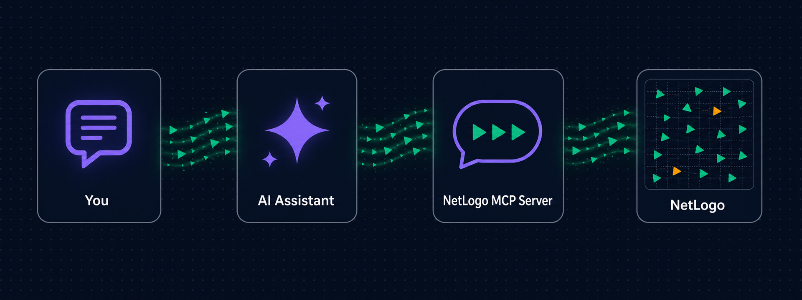

[](https://mseep.ai/app/razee4315-netlogo-mcp)

<p align="center">
  
</p>

<p align="center">
  <a href="https://pypi.org/project/netlogo-mcp/"></a>
  <a href="https://github.com/Razee4315/NetLogo-MCP/actions/workflows/ci.yml"></a>
  <a href="https://www.python.org/downloads/"></a>
  <a href="https://github.com/astral-sh/ruff"></a>
  <a href="https://mypy-lang.org/"></a>
  <a href="LICENSE"></a>
</p>

The first MCP (Model Context Protocol) server for NetLogo — enabling AI assistants to create, run, and analyze agent-based models through natural conversation.

**Works with:** Claude Code, Claude Desktop, Cursor, Windsurf, VS Code (Copilot), Cline, Continue, Roo Code, Zed, OpenCode, Codex — any tool that supports MCP.

<p align="center">
  
</p>

## Why NetLogo MCP?

As an AI student taking an Agent-Based Modeling course, I searched for an MCP server to control NetLogo — nothing existed. So I built one.

Instead of manually writing NetLogo code, clicking buttons, and tweaking sliders, you tell your AI assistant what you want in plain English:

> "Create a predator-prey model with 100 sheep and 20 wolves. Run it for 500 ticks and show me the population dynamics."

The AI writes the code, runs the simulation, and shows you the results — all through conversation.

<p align="center">
  
</p>

By default a real NetLogo window opens (on first use) so you can watch your simulations run live. Headless mode is available for CI or servers.

## Features

- **Create models from code** — with real interface widgets: sliders, switches, buttons, monitors
- **Run simulations** and collect tick-by-tick data as markdown tables
- **Run BehaviorSpace experiments** — parallel parameter sweeps via the headless launcher
- **Export the view as PNG** — visible inline in chat
- **Inspect everything** — world state, agent samples, patch grids for heatmaps
- **CoMSES Net integration** — search and safely run models from the largest peer-reviewed ABM library
- **Built-in references** — NetLogo primitives, programming guide, and 6→7 transition guide as MCP resources
- **Lazy startup** — the NetLogo window only opens when you actually use a tool, not when your AI client connects

See [docs/TOOLS.md](docs/TOOLS.md) for the full reference of all 25 tools, widget schema, and prompts.

## Prerequisites

| Requirement | Install via terminal? | How |
|-------------|----------------------|-----|
| **Python 3.10+** | Yes | Windows: `winget install Python.Python.3.12` · macOS: `brew install python@3.12` · Linux: `sudo apt install python3.12` |
| **Java JDK 11+** | Yes | Windows: `winget install EclipseAdoptium.Temurin.21.JDK` · macOS: `brew install --cask temurin` · Linux: `sudo apt install openjdk-21-jdk` |
| **NetLogo 7.0+** | **No — manual** | Download from [ccl.northwestern.edu/netlogo](https://ccl.northwestern.edu/netlogo/download.shtml) |

> **Only NetLogo requires manual download.** Everything else can be installed via terminal, and the Zero-Config Setup prompt below handles those automatically.

## Zero-Config Setup (Recommended)

If you're using an AI coding tool, copy the prompt below into your chat. The AI will detect your OS, find your NetLogo and Java installations, clone the repo, install dependencies, configure your MCP client, and tell you how to use it.

<details>
<summary><strong>Click to copy the setup prompt</strong></summary>

```
Please set up the NetLogo MCP server for me end-to-end. Follow these steps carefully:

1. **Detect my environment**
   - Identify my OS (Windows / macOS / Linux).
   - Check Python version (need 3.10+). If missing, tell me to install it first and stop.
   - Check for Java JDK 11+ (not JRE). Look in common locations (JAVA_HOME env var, standard install dirs). If missing, tell me to install Adoptium Temurin JDK 11+ and stop.
   - Check for NetLogo 7.0+. Look in common locations:
     - Windows: `C:/Program Files/NetLogo*`
     - macOS: `/Applications/NetLogo*`
     - Linux: `/opt/netlogo*`, `~/netlogo*`
     If NetLogo isn't installed, tell me to download it from https://ccl.northwestern.edu/netlogo/download.shtml and stop.

2. **Install**
   - Run: `pip install netlogo-mcp`
   - Verify the `netlogo-mcp` command is now available on my PATH.

3. **Identify my MCP client**
   - Figure out which AI tool I'm using (Claude Code, Cursor, Windsurf, Cline, Continue, Roo Code, Zed, OpenCode, VS Code Copilot, Codex, or Claude Desktop).
   - If you're not sure, ask me.

4. **Configure the MCP client**
   - Locate (or create) the correct config file for my client (see
     https://github.com/Razee4315/NetLogo-MCP/blob/main/docs/CLIENTS.md
     for exact paths and schemas per client).
   - Add a `netlogo` server entry with:
     - `command`: `netlogo-mcp`
     - `env.NETLOGO_HOME`: the NetLogo path you detected
     - `env.JAVA_HOME`: the JDK path you detected
   - Use the exact JSON schema for my specific client (e.g. `"type": "stdio"` for Cursor, `"servers"` key for VS Code).
   - Preserve any existing config entries — merge, don't overwrite.
   - IMPORTANT: configure it for THIS project only (project-scope config file), not globally, unless I say otherwise — a global entry loads the server in every session.

5. **Tell me what to do next**
   - Tell me to fully restart my AI tool for the new MCP server to load.
   - Tell me the NetLogo window opens on the FIRST model tool call, and that call takes 30–60 seconds while the Java Virtual Machine starts. Tell me NOT to click stop during this wait.
   - Give me this exact test prompt to try after restart:

     > "Create a simple predator-prey model with wolves and sheep on a green landscape. Run setup, then run 100 ticks while tracking wolf and sheep counts. Export the view before and after so I can see how the world evolved."

   - Tell me where models and exports are saved (by default, the current working directory's `models/` and `exports/` folders) and that I can browse them with the `list_models` tool.

Do not skip any verification step. If something fails, stop and tell me exactly what failed and how to fix it.
```

</details>

## Manual Installation

```bash
pip install netlogo-mcp
```

Then add the server to your MCP client. For Claude Code, add to your **project's** `.mcp.json`:

```json
{
  "mcpServers": {
    "netlogo": {
      "command": "netlogo-mcp",
      "args": [],
      "env": {
        "NETLOGO_HOME": "C:/Program Files/NetLogo 7.0.3",
        "JAVA_HOME": "C:/Program Files/Eclipse Adoptium/jdk-25.0.2.10-hotspot"
      }
    }
  }
}
```

Restart Claude Code and verify with `/mcp`.

> **Tip:** prefer project-scope config (`.mcp.json` in one project) over global config — a global entry loads the server in every session of every project.

**Using Cursor, Windsurf, VS Code, Cline, Continue, Roo Code, Zed, OpenCode, Codex, or Claude Desktop?** See [docs/CLIENTS.md](docs/CLIENTS.md) for exact config for all 11 clients. All configuration options (GUI/headless mode, directories, limits) are in [docs/CONFIGURATION.md](docs/CONFIGURATION.md).

**Developing or contributing?** Clone the repo and install editable instead:

```bash
git clone https://github.com/Razee4315/NetLogo-MCP.git
cd NetLogo-MCP
pip install -e ".[dev]"
```

### Docker

The image bakes in NetLogo (headless) with its bundled JRE — no host install needed:

```bash
docker build -t netlogo-mcp .
docker run -i --rm netlogo-mcp
```

MCP client config:

```json
{
  "mcpServers": {
    "netlogo": {
      "command": "docker",
      "args": ["run", "-i", "--rm", "netlogo-mcp"]
    }
  }
}
```

Docker runs headless only (no GUI mode). Add `-v ./exports:/data/exports` to keep exported views and worlds on the host.

## Quick Start

Once connected, try these prompts in any MCP client:

```
> Create a simple NetLogo model with 50 turtles doing a random walk.
  Run setup, simulate 100 ticks, and export the view.

> Open the Wolf Sheep Predation model and run a parameter sweep
  on initial-number-wolves from 10 to 100.

> Build a disease spread model with sliders for population size and
  infection chance.
```

> **The first model tool call takes 30-60 seconds** while the JVM starts — the NetLogo window appears when it's ready. Don't click stop. Every call after that is instant.

## Troubleshooting

| Problem | Solution |
|---------|----------|
| `NETLOGO_HOME is not set` | Set the environment variable to your NetLogo install directory |
| `JAVA_HOME is not set` | Set it to your JDK directory (not JRE) |
| JVM crashes on startup | Make sure JAVA_HOME points to JDK 11+, not an older version |
| `No model is loaded` | Call `open_model` or `create_model` before using other tools |
| First model call hangs for 30-60s | Normal — JVM is warming up. Don't click stop. |
| NetLogo window opens when my AI client starts | You have `NETLOGO_EAGER_START=true` set, or an old version — by default the window only opens on first tool use |
| Server won't connect | Run `netlogo-mcp` manually in terminal to see error output |

## Documentation

- [docs/TOOLS.md](docs/TOOLS.md) — Full tool reference, widget schema, BehaviorSpace & CoMSES guides
- [docs/CONFIGURATION.md](docs/CONFIGURATION.md) — All environment variables, GUI vs headless, startup timing
- [docs/SECURITY.md](docs/SECURITY.md) — Security model and trust boundary
- [docs/CLIENTS.md](docs/CLIENTS.md) — Setup for all 11 MCP clients
- [docs/DEVELOPMENT.md](docs/DEVELOPMENT.md) — Project structure, running tests, architecture notes
- [CONTRIBUTING.md](CONTRIBUTING.md) — How to contribute
- [CHANGELOG.md](CHANGELOG.md) — Version history

## Listed on

[](https://lobehub.com/mcp/razee4315-netlogo_mcp)

## Citing

If you use NetLogo MCP in research or teaching, please cite it — click
**"Cite this repository"** in the GitHub sidebar, or see [CITATION.cff](CITATION.cff).

## Author

**Saqlain Abbas**
Email: saqlainrazee@gmail.com
GitHub: [@Razee4315](https://github.com/Razee4315)
LinkedIn: [@saqlainrazee](https://www.linkedin.com/in/saqlainrazee/)

## License

This project is licensed under the [MIT License](LICENSE) — free to use, modify, and distribute for any purpose.

<!-- mcp-name: io.github.Razee4315/netlogo-mcp -->
